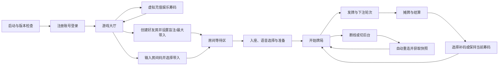
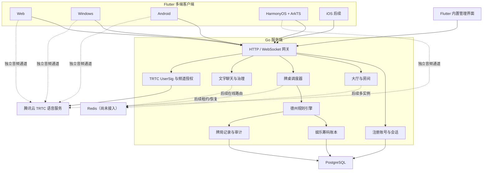

# 德州扑克游戏产品与架构规划

> 文档状态：已评审并按 `v0.1.1` 校正；阶段 3 单实例主链已完成
>
> 文档版本：1.0
>
> 更新日期：2026-09-01
>
> 目标平台：Windows Web、Windows 客户端、Android、HarmonyOS，后续视条件支持 iOS

本文同时保留最初产品规划和当前架构方向。精确的“已实现/未实现”边界以[项目现状](PROJECT_STATUS.md)为准，接手开发请先阅读[项目交接文档](PROJECT_HANDOVER.md)。

## 1. 文档目的

本文档用于在正式开发前统一首版产品范围、技术基线、系统架构、数据与通信方案、跨平台策略、质量标准及迭代计划。

评审通过后，应进一步拆分为：

- 产品需求文档（PRD）。
- UI/交互原型及视觉规范。
- 德州扑克规则规格说明。
- 客户端与服务端接口协议。
- 数据库设计。
- 测试计划与上线清单。

## 2. 当前产品假设

首版暂按以下假设规划，评审时需要确认：

- 产品定位为纯娱乐积分制德州扑克。
- 游戏筹码不能提现、不能兑换现实资产、不能在玩家之间自由转移。
- 首版以好友房为核心，不做真钱玩法和公开博彩大厅。
- 首版采用无限注德州扑克（No-Limit Texas Hold'em）。
- 单桌支持 2～10 名入座玩家。
- 牌桌采用横屏布局。
- 首版支持牌桌文字聊天和牌桌语音聊天。
- 产品只在熟人之间使用，不做互联网公开传播、公开房间发现或公开匹配。
- 所有玩家必须注册账号，不提供游客账号。
- iOS 退出首版验收范围，但架构和代码不得主动排除 iOS。

首版允许玩家在无支付界面中虚拟增发任意数量的娱乐筹码，仅用于熟人牌局测试，不对应订单或现实货币。如未来加入付费购买、玩家交易、现金或其他可兑换资产，需要重新开展法律合规、支付、账务、风控和安全评审，不能直接沿用本规划上线。

## 3. 产品定位与目标

### 3.1 目标用户

- 希望快速和朋友组织牌局的熟人玩家，不在互联网进行传播。

### 3.2 核心体验目标

1. 已注册用户进入应用后，可以在一分钟内创建或加入好友牌局。
2. 下注信息和操作按钮清晰，避免误操作和金额歧义。
3. 弱网、切后台或短时断线后，用户能够自动返回原牌桌。
4. 发牌、行动、筹码变化和结算均由服务端决定并可审计。
5. 语音或聊天服务异常时，不影响出牌、倒计时和结算。
6. 同一套核心客户端代码覆盖 Web、Windows、Android 和 HarmonyOS。

### 3.3 传播与注册边界

- 不在公开应用市场、公开网站、广告渠道或社交平台推广。
- Web 入口不做搜索引擎收录，并要求登录后才能进入业务页面。
- 注册由服务端开关控制；管理员可关闭公开注册并为熟人创建受管账号。当前未实现邀请码体系。
- Windows、Android 和 HarmonyOS 安装包仅进行私下分发。
- 不提供公开房间列表、陌生人推荐或公开匹配入口。

## 4. 技术基线

### 4.1 客户端

- UI 框架：Flutter。
- 业务语言：Dart。
- Flutter OH 仓库：<https://gitcode.com/CPF-Flutter/flutter_flutter>。
- 指定分支：[`oh-3.41.9-dev`](https://gitcode.com/CPF-Flutter/flutter_flutter/tree/oh-3.41.9-dev)。
- HarmonyOS 原生扩展：ArkTS。
- Android 原生扩展：Kotlin。
- 状态管理：当前使用 `StatefulWidget`、`ChangeNotifier`、回调和显式 service/client 对象；Riverpod 仅是早期候选，未引入。
- 路由：当前由应用顶层状态切换登录、大厅和牌桌；`go_router` 未引入。
- 实时牌局通信：WebSocket。
- 普通业务接口：HTTPS。

`oh-3.41.9-dev` 是可移动的开发分支。根据单人开发的评审决定，阶段 0 暂不锁定具体 commit；每次构建必须记录 `flutter --version` 和实际提交信息，出现工具链变化时先完成全平台回归验证再继续开发。

第三方依赖按以下优先级选择：

1. 纯 Dart 包。
2. CPF-Flutter 已适配并验证的 OHOS 插件。
3. 具有清晰平台接口、便于补充 OHOS 实现的插件。
4. 自行维护的 Flutter 插件或 Platform Channel 实现。

### 4.2 服务端

- 语言：Go。
- 首版形态：模块化单体。
- API：HTTPS + WebSocket。
- 主数据库：PostgreSQL。
- 缓存、在线状态及牌桌路由：当前为单实例进程内状态；Redis 是后续多实例目标，尚未接入运行时。
- 部署方式：容器化部署。
- 牌桌并发模型：每张牌桌由单一 Go 协程顺序处理事件。

### 4.3 聊天与实时语音

- 牌桌文字聊天：复用游戏 WebSocket 连接，但使用独立消息类型和独立限流策略。
- 牌桌语音聊天：使用腾讯云 TRTC 独立 RTC 通道，不通过游戏 WebSocket 传输音频。
- Android 和 Windows 优先使用腾讯 RTC Flutter SDK；Web 使用腾讯 RTC Web SDK；HarmonyOS 通过 ArkTS 接入腾讯 TRTC HarmonyOS SDK。
- 客户端通过统一的 `VoiceChatService` 接口隔离具体 RTC SDK。
- HarmonyOS 缺失的能力通过 ArkTS 插件及 Platform Channel 补齐。
- 腾讯云轻量应用服务器只负责业务服务和生成短期 `UserSig`，不转发音频媒体流。

## 5. 首版范围

### 5.1 P0：首版必须完成

#### 账号与基础资料

- 注册账号和密码登录，不提供游客登录。
- 注册入口受服务器注册开关控制；管理员关闭公开注册后按需创建熟人账号。
- 独立牌桌昵称和基于文字/位置的默认头像展示；自定义头像尚未实现。
- 会话刷新和退出登录。
- 用户登录后可修改密码，管理员也可重置；手机号或邮箱自助找回尚未实现。
- 基础用户协议、隐私提示及账号注销入口（当前尚未完成，保留为阶段 3 待办）。
- 每个账户拥有娱乐筹码余额，并可通过无支付的虚拟充值界面增发任意正整数筹码。

#### 大厅与好友房

- 创建好友房。
- 通过房间码加入。
- 当前所在房间恢复入口。
- 动态座位和两手之间的等待状态。
- 选择座位、准备、离桌。
- 房主身份明确标识；房主离开后按加入顺序移交，最后一人离开时房间关闭。
- 房主创建房间时自定义小盲、大盲和单个玩家最大带入。
- 玩家加入房间时自主选择从账户余额带入牌桌的筹码量。

#### 德州牌局

- 2～10 人无限注德州扑克。
- 庄家按钮、小盲和大盲轮转。
- 发底牌、翻牌、转牌、河牌和摊牌。
- 过牌、跟注、下注、加注、全下和弃牌。
- 主池和多层边池。
- 平分底池及余数分配规则。
- 操作倒计时和超时处理。
- 牌型展示、结算和下一局循环。
- 断线重连和完整状态恢复。
- 每手结束后允许主动补码，输光时自动弹出补码窗口；补码后牌桌筹码仍不得超过房间最大带入。
- 结算后主动亮牌、弃牌后的私下看牌申请和座位互换。
- 满足严格全下闭合条件时协商发一次/发两次，并支持两块公共牌独立结算。

#### 牌桌文字聊天

- 仅限当前牌桌成员发送和接收。
- 普通短文本、预设快捷语和表情。
- 消息时间和发送者座位信息。
- 本地屏蔽某一玩家。
- 服务端管理员禁言、内容长度限制和频率限制；房主不提供一键禁言能力。
- 断线重连后可拉取少量最近消息。
- 管理员持久化文字禁言和审计记录；玩家举报入口仍为阶段 3 待办。

#### 牌桌语音聊天

- 进入牌桌后可主动加入语音频道，不自动加入收听。
- 采用自由麦模式；加入语音后仍由用户明确开启麦克风。
- 麦克风开关、静音、扬声器/听筒或可用输出设备控制。
- 单独屏蔽某位玩家的语音。
- 玩家说话状态指示。
- 麦克风权限按需申请并提供拒绝后的引导。
- 切后台、来电、耳机和蓝牙设备切换后的音频焦点处理。
- 语音断开自动重连，但不得阻塞游戏连接。
- 离桌后立即退出对应语音频道。
- 首版默认不录音；如需要录音或实时审核，必须单独进行隐私与合规评审。

#### 设置与记录

- 音乐、游戏音效、语音音量、振动开关。
- 最近牌局概要。
- 当前版本、网络状态和基础诊断信息。

#### 管理与运维

- 用户、在线状态和当前房间查询。
- 用户封禁和聊天禁言。
- 牌局事件及娱乐筹码流水审计。
- 客户端最低版本和公告配置（尚未实现）。
- 健康/就绪检查和结构化错误日志已实现；指标和告警尚未完成。

### 5.2 P1：首版稳定后

- 新手教学及练习机器人。
- 好友系统和在线邀请。
- 观战。
- 更完整的牌局回放。
- 举报处理后台和更完善的内容治理。
- 排位、成就和任务。
- 更丰富的语音状态和管理员语音治理。

### 5.3 P2：中长期候选

- 锦标赛。
- 俱乐部。
- 主题牌桌和装扮类商品。
- 高级战绩分析。
- 多语言和多区域部署。
- 奥马哈等其他扑克玩法。

## 6. 首版房间配置

当前提供少量推荐预设，同时允许房主自定义盲注级别和最大带入。

建议支持：

- 创建时不设置人数上限；房间按实际进入人数动态扩展，2 人可开局，最多 10 人。
- 小盲最低 10、大盲最低 20，且大盲必须是小盲的整数倍。
- 单个玩家最大带入，创建房间后不可修改。
- 普通行动固定 30 秒；一手只剩两名未弃牌玩家时固定 60 秒，并有每手两张 30 秒加时卡。
- 不允许在一手牌进行期间加入；新玩家等待当前手牌结算后入座。
- 可选房间密码。
- 房间有效到最后一名成员离开。

首版提供以下默认预设，房主可以在此基础上调整：

| 预设 | 最大带入 | 小盲/大盲 | 操作时间 |
|---|---:|---:|---:|
| 休闲 | 1000 | 10/20 | 30 秒 |
| 标准 | 2000 | 10/20 | 30 秒 |
| 深筹 | 5000 | 10/20 | 30 秒 |

玩家入房时自主选择带入量。带入和补码都从账户娱乐筹码余额转入牌桌，仅能在未参与进行中手牌时完成；每手结束后所有玩家均可主动补码，筹码为 0 的玩家自动看到补码窗口。离桌或房间关闭时，剩余牌桌筹码退回账户余额。

## 7. 核心用户流程



## 8. 总体系统架构



### 8.1 架构原则

- 服务端是牌局状态的唯一权威来源。
- 客户端只负责显示、动画、输入和连接管理。
- 规则引擎不直接访问网络和数据库。
- 文字聊天与牌局共享传输连接，但逻辑、权限和限流独立。
- 语音音频走独立 RTC 通道，RTC 故障不得影响牌局。
- 首版不拆微服务；达到实际容量瓶颈后再按模块拆分。
- 所有平台能力通过适配接口隔离，避免业务代码直接依赖插件。
- 当前生产形态是单 Go 实例；Redis、多实例租约和运行中牌桌故障接管仍属于阶段 3 后续工作。

## 9. Flutter 客户端架构

早期建议目录与当前实现大体一致，但实际代码按功能页、domain、core service 和平台适配组织。当前关键入口与技术债见[项目交接文档](PROJECT_HANDOVER.md)。

```text
lib/
├─ app/
│  ├─ app.dart
│  ├─ router.dart
│  └─ theme/
├─ core/
│  ├─ network/
│  ├─ storage/
│  ├─ logging/
│  ├─ errors/
│  └─ platform/
├─ features/
│  ├─ auth/
│  ├─ lobby/
│  ├─ room/
│  ├─ table/
│  ├─ chat/
│  ├─ voice/
│  ├─ history/
│  ├─ profile/
│  └─ settings/
├─ game/
│  ├─ models/
│  ├─ table_state/
│  ├─ animations/
│  ├─ widgets/
│  └─ layout/
└─ platform_adapters/
   ├─ audio/
   ├─ voice_chat/
   ├─ haptics/
   ├─ lifecycle/
   ├─ secure_storage/
   └─ device_info/
```

### 9.1 UI 与动画

- 牌桌以 Flutter Widget 和动画系统为主。
- 使用 `Stack`、`Positioned` 和响应式布局实现座位分布。
- 使用 `AnimationController` 控制发牌、筹码移动和结算动画。
- 使用 `CustomPainter` 绘制桌面或低频特效。
- 对频繁刷新的牌桌区域使用 `RepaintBoundary`。
- 首版不依赖 Flame；出现复杂粒子或游戏循环需求后再局部引入。
- 横屏优先，同时适配手机长屏、平板和可缩放 Windows 窗口。

### 9.2 平台能力接口

业务层不得直接调用具体平台插件，至少建立以下接口：

- `VoiceChatService`
- `GameAudioService`
- `HapticService`
- `SecureStorageService`
- `LifecycleService`
- `DeviceInfoService`
- `ShareService`
- `PermissionService`

HarmonyOS 缺失能力通过 ArkTS 和 Platform Channel 实现；Android 特殊能力通过 Kotlin 实现。

## 10. 服务端牌桌模型

每张牌桌由一个独立 Go 协程拥有状态，所有玩家操作顺序进入牌桌消息队列。

```text
玩家操作
  → WebSocket 网关
  → 身份及会话校验
  → 定位牌桌协程
  → 进入牌桌消息队列
  → 顺序校验和执行
  → 生成领域事件
  → 持久化关键事件
  → 向对应玩家广播可见结果
```

牌桌状态机：

```text
WAITING
→ STARTING
→ PREFLOP
→ FLOP
→ TURN
→ RIVER
→ SHOWDOWN
→ SETTLEMENT
→ WAITING_NEXT_HAND
```

所有状态转换由服务端规则引擎完成，客户端不得自行推进轮次。

## 11. 通信协议

### 11.1 HTTP

用于低频业务：

- 登录和刷新令牌。
- 用户资料。
- 创建、查询和加入房间。
- 历史牌局。
- 举报。
- 公告、版本和远程配置。
- 获取 RTC 临时令牌。

### 11.2 WebSocket

用于：

- 进入和离开牌桌。
- 玩家行动。
- 牌桌状态和倒计时。
- 发牌与结算事件。
- 断线重连。
- 牌桌文字聊天和快捷表情。

统一消息外壳建议：

```json
{
  "version": 1,
  "type": "table.action.submit",
  "requestId": "uuid",
  "sequence": 128,
  "tableId": "table_xxx",
  "handId": "hand_xxx",
  "serverTime": 1787540000000,
  "payload": {}
}
```

核心字段：

- `requestId`：实现请求幂等。
- `sequence`：检测丢失、乱序和状态缺口。
- `tableId`：定位牌桌。
- `handId`：隔离不同手牌的操作。
- `tableRevision`：验证客户端提交操作时看到的状态版本。
- `serverTime`：统一倒计时基准。

玩家行动示例：

```json
{
  "actionId": "uuid",
  "tableRevision": 52,
  "action": "raise",
  "amount": 400
}
```

文字聊天消息示例：

```json
{
  "version": 1,
  "type": "table.chat.send",
  "requestId": "uuid",
  "tableId": "table_xxx",
  "payload": {
    "clientMessageId": "uuid",
    "kind": "text",
    "content": "漂亮的一手"
  }
}
```

服务端应返回最终消息 ID、发送时间和过滤后的内容。客户端不得直接把本地消息当成服务端已确认消息。

## 12. 语音聊天架构

### 12.1 频道和授权

- 每张牌桌对应一个临时语音频道，例如 `table:{tableId}`。
- 客户端不能自行生成 RTC 永久凭证。
- 用户入座且通过房间权限校验后，由 Go 服务端签发短期 TRTC `UserSig`。
- Token 至少绑定用户、牌桌、角色和过期时间。
- 离桌、被踢、封禁或房间关闭后，服务端撤销或不再续签权限。

### 12.2 客户端行为

- 入桌后显示“加入语音”开关，不自动开启麦克风。
- 清晰显示麦克风工作状态和正在说话的玩家。
- 游戏音效与语音音量分别控制。
- 有人发言时可适当降低背景音乐，不降低关键操作提示音。
- 用户屏蔽某玩家后，同时停止播放该玩家语音并隐藏其文字消息。
- 语音重连采用独立退避策略，不触发牌桌重连。

### 12.3 必测平台能力

- Web 麦克风授权、安全上下文和浏览器自动播放限制。
- Windows 麦克风设备选择和窗口失焦。
- Android 音频焦点、权限、来电、蓝牙和有线耳机。
- HarmonyOS 麦克风权限、音频路由、后台切换及 ArkTS 桥接。
- 所有平台的回声消除、降噪、弱网表现和设备切换。

### 12.4 内容治理与隐私

- 首版默认不录制语音。
- 首次开启语音前明确说明麦克风用途。
- 提供静音、屏蔽和举报入口。
- 服务端记录加入/退出频道、禁言和举报等元数据，不记录音频内容。
- 如未来加入录音、语音审核或声纹能力，必须重新进行隐私和合规评审。

## 13. 断线恢复

服务端需要保留：

- 当前牌桌状态。
- 手牌阶段和牌桌版本。
- 玩家筹码、底池和边池。
- 当前行动玩家和服务器截止时间。
- 对该玩家可见的底牌。
- 最近一段牌桌事件序列。

恢复流程：

1. 客户端使用会话及最后收到的 `sequence` 重连。
2. 服务端验证玩家身份、房间和座位。
3. 差距较小时补发缺失事件。
4. 差距较大时发送完整牌桌快照。
5. 客户端中止与快照冲突的旧动画并恢复当前画面。
6. 若仍轮到该玩家，显示服务器计算后的剩余时间。
7. 游戏连接恢复后，再独立恢复文字聊天历史和 RTC 语音连接。

任何时候状态快照优先于客户端动画。

## 14. 数据模型

当前 PostgreSQL 核心数据表：

```text
users                 用户、角色、状态与文字禁言
refresh_sessions      可撤销刷新会话
account_wallets       娱乐筹码账户余额
bankroll_entries      钱包追加式流水
bankroll_settlements  钱包/牌桌结算幂等记录
rooms                 好友房规则和房主
room_members          成员、座位和牌桌筹码
hands                 每一手及一块/两块公共牌
hand_players          本手参与者和结果
hand_actions          玩家行动
hand_ledger_entries   本手结算账本
chat_messages         牌桌文字消息
audit_events          管理审计
schema_migrations     迁移版本和校验和
```

娱乐筹码也应使用只追加的账本流水，不应只维护一个可被任意覆盖的余额字段。

举报、语音加入/退出元数据和客户端版本策略尚未建表，仍在阶段 3 待办中。

## 15. 公平性与安全

- 使用服务端密码学安全随机数。
- 服务端执行 Fisher–Yates 洗牌。
- 客户端永远不获取完整牌堆。
- 底牌只发送给拥有该底牌的连接。
- 所有下注合法性由服务端验证。
- 所有娱乐筹码变化产生不可变账本流水。
- 敏感牌局日志加密或严格限制访问。
- HTTP 使用 TLS，WebSocket 使用 WSS。
- Access Token 短有效期，Refresh Token 可撤销。
- 登录、建房、牌局操作和聊天分别限流。
- 文字内容进行长度、字符和必要的内容治理处理。
- TRTC `UserSig` 短期有效；业务服务在签发前校验账号、牌桌和座位权限。
- 管理后台不得直接修改进行中的牌局。

## 16. 测试策略

### 16.1 规则引擎

必须覆盖：

- 所有标准牌型比较。
- A2345 顺子。
- 公共牌即最佳牌型。
- 平分底池和余数分配。
- 单人及多人全下。
- 多层边池。
- 盲注玩家离桌或断线。
- 玩家超时。
- 最后一名未弃牌玩家直接获胜。
- 重复、乱序和过期操作。
- 牌局中途断线重连。

### 16.2 自动牌局模拟

开发无界面的虚拟玩家程序：

- 自动创建 2～10 名玩家。
- 随机执行合法操作。
- 连续模拟至少十万手作为首阶段门槛。
- 检查筹码总量守恒。
- 检查底池和玩家筹码不为负。
- 检查每局必然结束。
- 检查结算与账本一致。

### 16.3 客户端与跨平台

- 多种屏幕比例的 Golden Test。
- Windows 窗口缩放。
- Web 浏览器缩放及刷新恢复。
- Android/HarmonyOS 安全区域。
- 前后台切换。
- 网络断开、恢复、延迟、重复和乱序。
- 长时间牌桌运行的内存和帧率。

### 16.4 文字和语音聊天

- 文字频率、长度、重复消息和非法房间消息。
- 断线后最近消息恢复。
- 禁言、屏蔽和举报。
- 麦克风授权允许、拒绝及永久拒绝。
- RTC 连接失败不影响牌局。
- 语音断开和恢复。
- 切后台、来电、耳机和蓝牙切换。
- 同桌 10 人自由麦语音的回声、噪声、延迟和弱网表现。
- 离桌或被踢后无法继续留在语音频道。

## 17. 当前代码仓库

```text
texas/
├─ apps/
│  └─ poker_client/          Flutter OH 客户端及内置管理界面
├─ services/
│  └─ game_server/           Go 服务、测试、迁移和 Dockerfile
├─ deploy/                   本地依赖编排
├─ docs/                     产品、规则、协议、阶段、部署和发布
├─ .env.example              无敏感值配置模板
└─ CLAUDE.md                 Claude Code 接手约定
```

Flutter SDK、Dart/Go 依赖、Android SDK/NDK、DevEco Studio、HarmonyOS SDK 和 RTC SDK 都必须记录经过验证的版本。

## 18. 版本与构建策略

首版目标构建矩阵：

| 目标 | 构建基线 |
|---|---|
| Web | `oh-3.41.9-dev`，构建时记录实际版本 |
| Windows | `oh-3.41.9-dev`，构建时记录实际版本 |
| Android | 同一分支 + 锁定 Android 工具链 |
| HarmonyOS | 同一分支 + 锁定 DevEco/HarmonyOS 工具链 |
| iOS | 退出首版验收范围 |

每次升级 Flutter OH 或关键插件必须执行：

- 全平台构建。
- 插件兼容性检查。
- Golden Test。
- WebSocket 断线恢复测试。
- RTC 语音测试。
- 牌桌稳定性测试。
- Android/HarmonyOS 真机冒烟测试。

## 19. 开发路线图

### 阶段 0：技术验证，1～2 周

交付：

- 记录 Flutter OH 实际提交和配套工具链版本。
- Web、Windows、Android、HarmonyOS 空项目构建成功。
- Flutter 与 ArkTS Platform Channel 示例。
- Flutter 与 Go 的 WebSocket 连接。
- 10 人牌桌静态界面和一次模拟发牌动画。
- 断线恢复最小样例。
- 文字聊天最小样例。
- 腾讯云 TRTC 四端接入验证。
- 四端语音加入、发言、静音和退出最小样例。
- 音频、权限、生命周期和本地存储兼容清单。

退出标准：四个平台均能加入同一测试牌桌，完成模拟发牌、文字消息和双向语音，关闭语音服务后牌局连接仍然正常。

### 阶段 1：规则与协议，2～3 周

交付：

- 德州规则引擎。
- 牌型计算、主池和边池。
- 牌桌状态机。
- WebSocket 协议 v1。
- 聊天消息协议和权限模型。
- TRTC `UserSig` 和频道授权接口。
- 虚拟玩家模拟器。
- 规则自动化测试。

退出标准：连续模拟十万手，无筹码守恒错误和无法结束的牌局。

### 阶段 2：可玩 MVP，5～7 周（已完成）

交付：

- 登录、大厅和好友房。
- 2～10 人完整牌局。
- 下注、结算和断线恢复。
- 文字聊天、快捷消息、屏蔽和禁言。
- 语音加入、静音、屏蔽、音量和状态显示。
- 音效、动画和基础设置。
- 最近牌局记录。

退出标准：10 台客户端能连续完成至少 100 手真实联机牌局，同时使用文字和语音功能，无状态不一致。

### 阶段 3：上线准备（进行中）

交付：

- 账户娱乐筹码余额、无支付虚拟充值、房间最大带入、入房带入及补码。
- 内置管理界面（账号、在线/房间、注册开关、筹码、密码、禁言和强制离桌已完成）。
- 基础聊天治理已完成；玩家举报仍待实现。
- 日志、监控和告警。
- 用户协议、隐私提示和账号注销流程。
- 灰度版本控制。
- 数据库备份和恢复演练。
- 弱网、压力和 RTC 稳定性测试。
- Web/Windows/Android/HarmonyOS 构建和部署流程已完成；正式签名、CI 和稳定性门槛仍待补齐。

退出标准：系统持续运行 24 小时无牌局状态错误；游戏、文字聊天和语音中任一服务故障时，其余关键功能可以按设计降级或恢复。

详细任务拆分、实施顺序和验收口径见 [阶段 3 上线准备计划](PHASE_3_PLAN.md)。

### 19.1 粗略周期

- 2～3 名全职开发人员：封闭测试版约 3～4 个月。
- 1 名全职开发人员：更现实的周期约 5～8 个月。
- 语音 SDK 的 HarmonyOS 适配状况可能显著影响工期，必须以阶段 0 结果重新估算。

## 20. 首版验收指标

功能及质量门槛建议：

- 德州规则测试全部通过。
- 自动模拟十万手无筹码守恒和结算错误。
- 10 人桌连续进行 100 手无状态不一致。
- 游戏连接中断后可恢复到正确牌桌状态。
- 重复提交同一操作不会重复扣减筹码。
- 文字消息不能跨牌桌发送或接收。
- 被禁言用户无法发送文字消息。
- 离桌用户无法继续加入该牌桌 RTC 频道。
- RTC 服务不可用时仍可正常完成牌局。
- Web、Windows、Android、HarmonyOS 均通过核心流程冒烟测试。
- 服务连续运行 24 小时无不可恢复错误。

## 21. 评审决策记录

以下事项已确认：

- [x] 首版是否确定为纯娱乐积分制。
- [x] 首版是否只做好友房，不做公开匹配。
- [x] 单桌人数是否确定为 2～10 人。
- [x] 是否只支持横屏。
- [x] 房主可基于预设自定义小盲、大盲和最大带入；行动时间按规则统一为普通 30 秒、两名未弃牌玩家 60 秒。
- [x] 每个账户拥有总娱乐筹码量，并提供不接入支付平台的任意数量虚拟充值。
- [x] 玩家入房时自主选择带入量，牌桌筹码不得超过房间最大带入。
- [x] 每手结束后允许所有玩家补码，输光玩家自动弹出补码窗口。
- [x] 是否允许玩家牌局中途入座。——不允许，在一局游戏（一个小局）结束后才可入座。
- [x] 文字聊天是否允许自由文本，还是首测只开放快捷语和表情。——允许自由文本，同时也要预设一些快捷语和表情。
- [x] 首版语音采用自由麦、按键发言，还是两者都支持。——采用自由麦。
- [x] 入桌后是否自动加入语音收听；本文档默认由用户主动加入。
- [x] 首版是否明确不录制语音。
- [x] RTC 采用腾讯云 TRTC；轻量应用服务器不承担音频转发。
- [x] 是否需要房主一键禁言全桌或指定玩家。——不需要
- [x] 游客账号是否必须绑定后才能查看长期战绩。——不做游客账号，每个玩家都需要注册账号。
- [x] Windows 内测先提供压缩包，稳定后同时提供安装程序。
- [x] iOS 是否完全退出首版验收范围。——是的
- [x] Flutter OH `oh-3.41.9-dev` 的首个锁定 commit。——不需要，项目只有我一人开发

## 22. 当前后续入口

阶段 0～2 和阶段 3 单实例主链均已实施。后续不再按最初评审步骤推进，接手者应从[项目现状](PROJECT_STATUS.md)的风险与推荐下一步、[阶段 3 计划](PHASE_3_PLAN.md)的未完成项和[项目交接文档](PROJECT_HANDOVER.md)开始。
