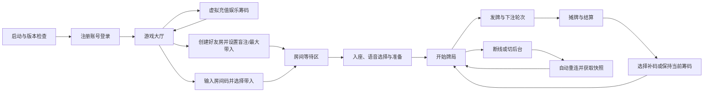

# 产品决策与架构背景

> 用途：**在改变技术栈、产品边界，或想知道某个产品问题当初是怎么定的时候读它。**
>
> 本文只保留「为什么这么选」和「哪些事已经定过、不必再讨论」。所有「现在是什么样」的问题，
> 请查[项目现状](PROJECT_STATUS.md)；规则、协议、数据模型和测试策略以各自的规范文档为准，
> 本文不再重复，以免两处描述互相矛盾。
>
> 原文是 2026 年立项时的完整评审记录，2026-09-02 删去了已被规范文档取代的章节。
> 完整原文可在 Git 历史中查到，演进过程见[开发历程](DEVELOPMENT_HISTORY.md)。

## 1. 产品假设

这些假设已在立项评审中确认，是后续所有设计的前提：

- 产品定位为纯娱乐积分制德州扑克。
- 游戏筹码不能提现、不能兑换现实资产、不能在玩家之间自由转移。
- 首版以好友房为核心，不做真钱玩法和公开博彩大厅。
- 首版采用无限注德州扑克（No-Limit Texas Hold'em）。
- 单桌支持 2～10 名入座玩家。
- 牌桌采用横屏布局。
- 首版支持牌桌文字聊天和牌桌语音聊天。
- 产品只在熟人之间使用，不做互联网公开传播、公开房间发现或公开匹配。
- 所有玩家必须注册账号，不提供游客账号。
- iOS 退出首版验收范围，但架构和代码不得主动排除 iOS。

首版允许玩家在无支付界面中虚拟增发任意数量的娱乐筹码，仅用于熟人牌局测试，不对应订单或现实货币。如未来加入付费购买、玩家交易、现金或其他可兑换资产，需要重新开展法律合规、支付、账务、风控和安全评审，不能直接沿用本规划上线。

## 2. 产品定位与目标

### 2.1 目标用户

- 希望快速和朋友组织牌局的熟人玩家，不在互联网进行传播。

### 2.2 核心体验目标

1. 已注册用户进入应用后，可以在一分钟内创建或加入好友牌局。
2. 下注信息和操作按钮清晰，避免误操作和金额歧义。
3. 弱网、切后台或短时断线后，用户能够自动返回原牌桌。
4. 发牌、行动、筹码变化和结算均由服务端决定并可审计。
5. 语音或聊天服务异常时，不影响出牌、倒计时和结算。
6. 同一套核心客户端代码覆盖 Web、Windows、Android 和 HarmonyOS。

### 2.3 传播与注册边界

- 不在公开应用市场、公开网站、广告渠道或社交平台推广。
- Web 入口不做搜索引擎收录，并要求登录后才能进入业务页面。
- 注册由服务端开关控制；管理员可关闭公开注册并为熟人创建受管账号。当前未实现邀请码体系。
- Windows、Android 和 HarmonyOS 安装包仅进行私下分发。
- 不提供公开房间列表、陌生人推荐或公开匹配入口。

## 3. 技术基线

### 3.1 客户端

- UI 框架：Flutter。
- 业务语言：Dart。
- Flutter OH 仓库：<https://gitcode.com/CPF-Flutter/flutter_flutter>。
- 指定分支：[`oh-3.41.9-dev`](https://gitcode.com/CPF-Flutter/flutter_flutter/tree/oh-3.41.9-dev)。
- HarmonyOS 原生扩展：ArkTS。
- Android 原生扩展：Kotlin。
- 状态管理：当前使用 `StatefulWidget`、`ChangeNotifier`、回调和显式 service/client 对象；Riverpod 仅是早期候选，未引入。
- 路由：当前由应用顶层状态切换登录、大厅和牌桌；`go_router` 未引入。
- 实时牌局通信：WebSocket。
- 普通业务接口：HTTPS。

`oh-3.41.9-dev` 是可移动的开发分支。根据单人开发的评审决定，阶段 0 暂不锁定具体 commit；每次构建必须记录 `flutter --version` 和实际提交信息，出现工具链变化时先完成全平台回归验证再继续开发。

第三方依赖按以下优先级选择：

1. 纯 Dart 包。
2. CPF-Flutter 已适配并验证的 OHOS 插件。
3. 具有清晰平台接口、便于补充 OHOS 实现的插件。
4. 自行维护的 Flutter 插件或 Platform Channel 实现。

### 3.2 服务端

- 语言：Go。
- 首版形态：模块化单体。
- API：HTTPS + WebSocket。
- 主数据库：PostgreSQL。
- 缓存、在线状态及牌桌路由：单实例进程内状态。Redis 与多实例经评估后决定暂缓，见 [ADR-002](decisions/ADR-002-MULTI-INSTANCE.md)。
- 部署方式：容器化部署。
- 牌桌并发模型：每张牌桌由单一 Go 协程顺序处理事件。

### 3.3 聊天与实时语音

- 牌桌文字聊天：复用游戏 WebSocket 连接，但使用独立消息类型和独立限流策略。
- 牌桌语音聊天：使用腾讯云 TRTC 独立 RTC 通道，不通过游戏 WebSocket 传输音频。
- Android 和 Windows 优先使用腾讯 RTC Flutter SDK；Web 使用腾讯 RTC Web SDK；HarmonyOS 通过 ArkTS 接入腾讯 TRTC HarmonyOS SDK。
- 客户端通过统一的 `VoiceChatService` 接口隔离具体 RTC SDK。
- HarmonyOS 缺失的能力通过 ArkTS 插件及 Platform Channel 补齐。
- 腾讯云轻量应用服务器只负责业务服务和生成短期 `UserSig`，不转发音频媒体流。

## 4. 首版范围

### 4.1 首版必须完成的范围

首版 P0 的逐条清单已全部交付，为避免与实现状态两处描述互相矛盾，这里不再罗列，
精确的已实现/未实现边界见[项目现状](PROJECT_STATUS.md)。留在本文的是范围**边界**：

- 不提供游客登录，每个玩家都必须注册账号。
- 不做公开匹配、排行榜、现金交易和互联网推广。
- 不接支付、不提现、不兑换现实资产；虚拟充值只是无支付的筹码增发。
- 不做自定义头像、手机号/邮箱自助找回、客户端最低版本与公告配置。

### 4.2 P1：首版稳定后

- 新手教学及练习机器人。
- 好友系统和在线邀请。
- 观战。
- 更完整的牌局回放。
- 排位、成就和任务。
- 更丰富的语音状态和管理员语音治理。

### 4.3 P2：中长期候选

- 锦标赛。
- 俱乐部。
- 主题牌桌和装扮类商品。
- 高级战绩分析。
- 多语言和多区域部署。
- 奥马哈等其他扑克玩法。

## 5. 首版房间配置

当前提供少量推荐预设，同时允许房主自定义盲注级别和最大带入。

建议支持：

- 创建时不设置人数上限；房间按实际进入人数动态扩展，2 人可开局，最多 10 人。
- 小盲最低 10、大盲最低 20，且大盲必须是小盲的整数倍。
- 单个玩家最大带入，创建房间后不可修改。
- 普通行动固定 30 秒；一手只剩两名未弃牌玩家时固定 60 秒，并有每手两张 30 秒加时卡。
- 不允许在一手牌进行期间加入；新玩家等待当前手牌结算后入座。
- 可选房间密码。
- 房间有效到最后一名成员离开。

首版提供以下默认预设，房主可以在此基础上调整：

| 预设 | 最大带入 | 小盲/大盲 | 操作时间 |
|---|---:|---:|---:|
| 休闲 | 1000 | 10/20 | 30 秒 |
| 标准 | 2000 | 10/20 | 30 秒 |
| 深筹 | 5000 | 10/20 | 30 秒 |

玩家入房时自主选择带入量。带入和补码都从账户娱乐筹码余额转入牌桌，仅能在未参与进行中手牌时完成；每手结束后所有玩家均可主动补码，筹码为 0 的玩家自动看到补码窗口。离桌或房间关闭时，剩余牌桌筹码退回账户余额。

## 6. 核心用户流程

## 7. 规范文档的分工

以下内容曾在本文展开，现在各有权威文档，本文不再重复：

| 主题 | 权威文档 |
|---|---|
| 牌局规则、金额语义、位置表、状态机、不变量 | [德州扑克规则规格](TEXAS_HOLDEM_RULES_V1.md) |
| 消息外壳、幂等、序号补发、快照裁剪、错误码 | [WebSocket 协议](WEBSOCKET_PROTOCOL_V1.md) |
| 当前架构、数据库版本、已交付能力与风险 | [项目现状](PROJECT_STATUS.md) |
| 数据模型 | `services/game_server/migrations/` 下的编号迁移 |
| 语音接入方式与客户端边界 | [ADR-001](decisions/ADR-001-VOICE-RTC.md) |
| 多实例与 Redis | [ADR-002](decisions/ADR-002-MULTI-INSTANCE.md) |
| 测试与验收口径 | [验收指南](ACCEPTANCE_GUIDE.md)，以及仓库内的自动化测试 |

## 8. 公平性与安全总则

- 使用服务端密码学安全随机数。
- 服务端执行 Fisher–Yates 洗牌。
- 客户端永远不获取完整牌堆。
- 底牌只发送给拥有该底牌的连接。
- 所有下注合法性由服务端验证。
- 所有娱乐筹码变化产生不可变账本流水。
- 敏感牌局日志加密或严格限制访问。
- HTTP 使用 TLS，WebSocket 使用 WSS。
- Access Token 短有效期，Refresh Token 可撤销。
- 登录、建房、牌局操作和聊天分别限流。
- 文字内容进行长度、字符和必要的内容治理处理。
- TRTC `UserSig` 短期有效；业务服务在签发前校验账号、牌桌和座位权限。
- 管理后台不得直接修改进行中的牌局。

## 9. 已定论的产品问题

以下问题在立项评审中已经定论，不需要重新讨论；要推翻其中任何一条，应先更新本文并说明理由。

带 `——` 的条目直接写明了结论；其余条目的结论即为该问句的肯定形式。

- [x] 首版是否确定为纯娱乐积分制。
- [x] 首版是否只做好友房，不做公开匹配。
- [x] 单桌人数是否确定为 2～10 人。
- [x] 是否只支持横屏。
- [x] 房主可基于预设自定义小盲、大盲和最大带入；行动时间按规则统一为普通 30 秒、两名未弃牌玩家 60 秒。
- [x] 每个账户拥有总娱乐筹码量，并提供不接入支付平台的任意数量虚拟充值。
- [x] 玩家入房时自主选择带入量，牌桌筹码不得超过房间最大带入。
- [x] 每手结束后允许所有玩家补码，输光玩家自动弹出补码窗口。
- [x] 是否允许玩家牌局中途入座。——不允许，在一局游戏（一个小局）结束后才可入座。
- [x] 文字聊天是否允许自由文本，还是首测只开放快捷语和表情。——允许自由文本，同时也要预设一些快捷语和表情。
- [x] 首版语音采用自由麦、按键发言，还是两者都支持。——采用自由麦。
- [x] 入桌后是否自动加入语音收听；本文档默认由用户主动加入。
- [x] 首版是否明确不录制语音。
- [x] RTC 采用腾讯云 TRTC；轻量应用服务器不承担音频转发。
- [x] 是否需要房主一键禁言全桌或指定玩家。——不需要
- [x] 游客账号是否必须绑定后才能查看长期战绩。——不做游客账号，每个玩家都需要注册账号。
- [x] Windows 内测先提供压缩包，稳定后同时提供安装程序。
- [x] iOS 是否完全退出首版验收范围。——是的
- [x] Flutter OH `oh-3.41.9-dev` 的首个锁定 commit。——不需要，项目只有我一人开发

